# Coordi

**Coordi** is a cross-platform mobile app for everything tied to a point on Earth: where the
Sun and Moon rise and set, when the next eclipse is, the local weather and time, the geodesic
distance between two coordinates, and live GPS speed/distance tracking — for any city in the
world or your current location.

Built with **.NET MAUI** for Android and iOS, fully localized into **11 languages**, with
light/dark theming.

[](https://play.google.com/store/apps/details?id=com.cutecompute.coordi)


---

## Screenshots

<p align="center"><strong>Android</strong></p>
<p align="center">
  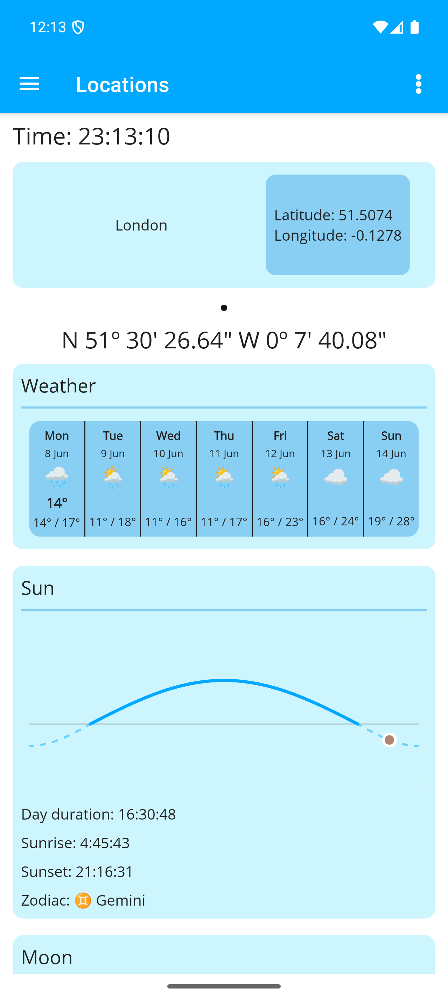
  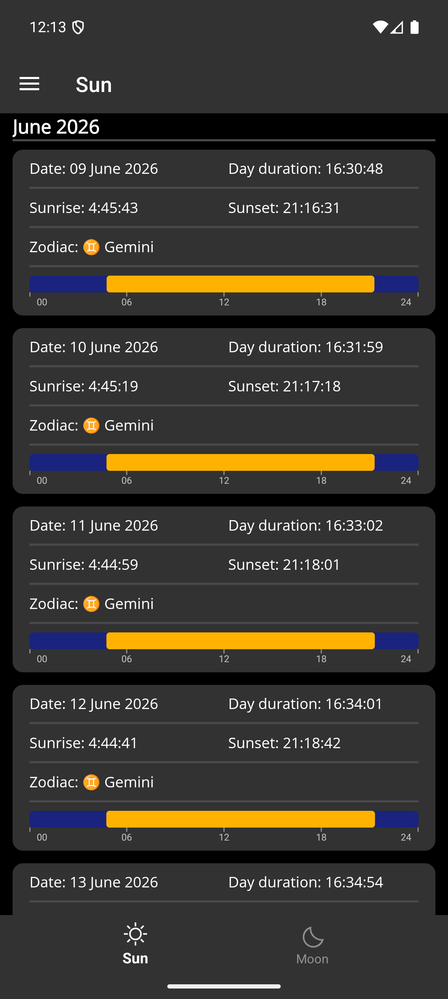
  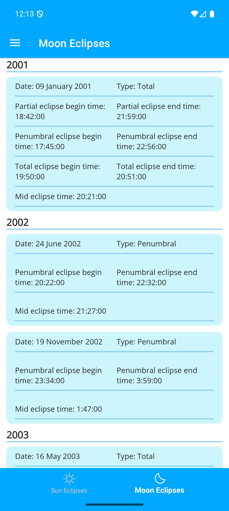
  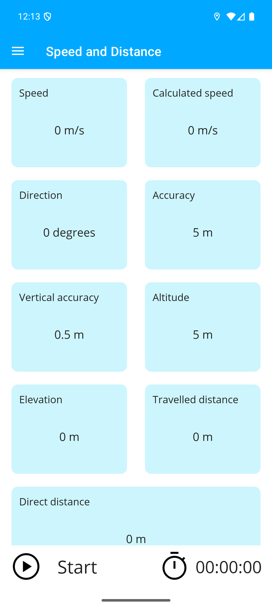
</p>
<p align="center">
  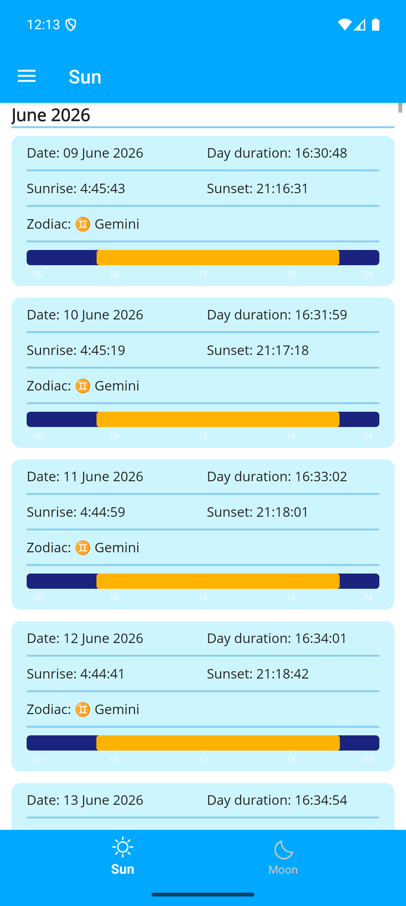
  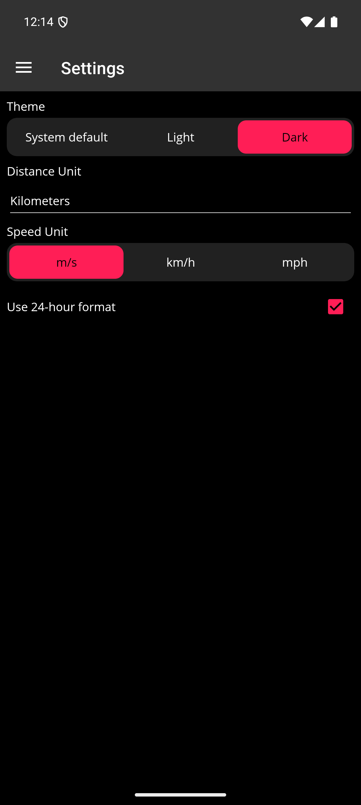
</p>

<p align="center"><strong>iPhone</strong></p>
<p align="center">
  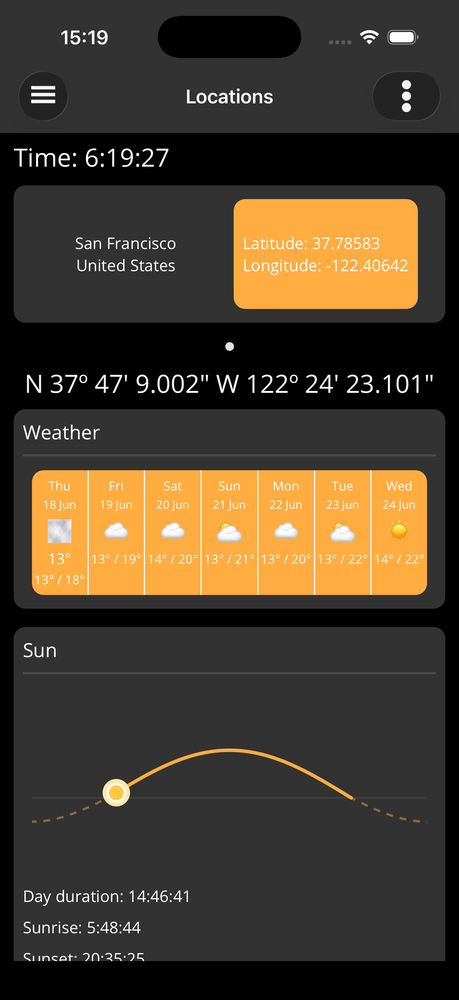
  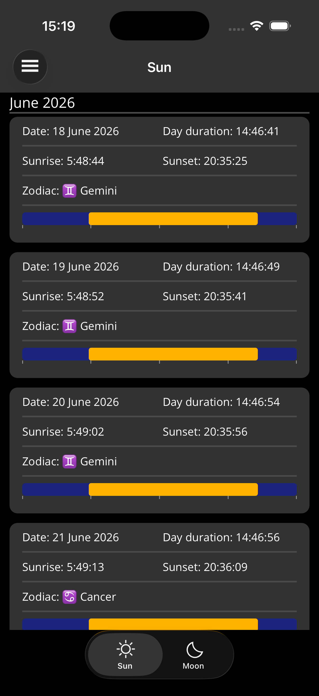
  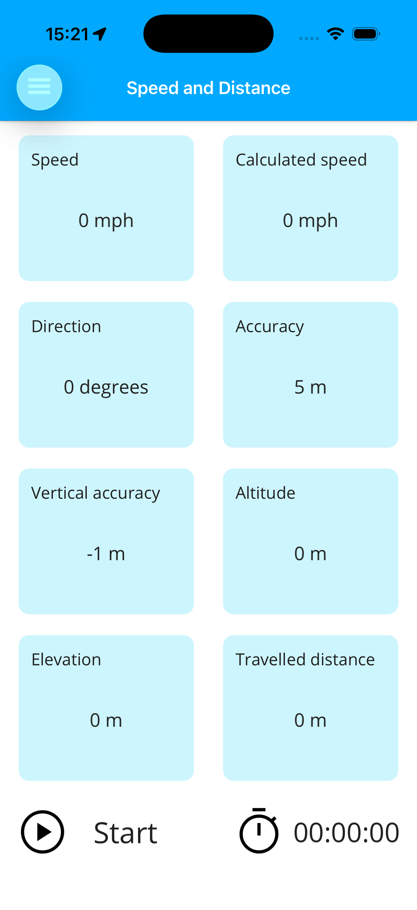
</p>
<p align="center">
  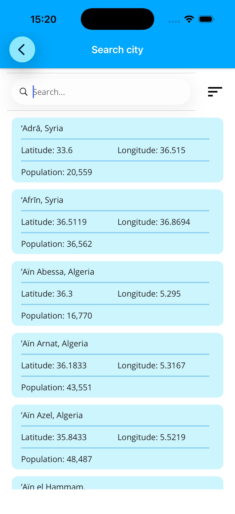
  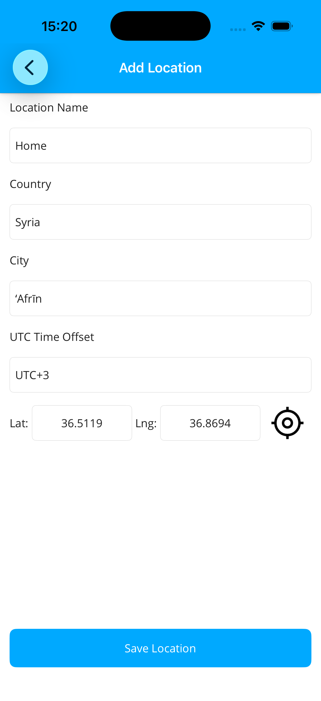
</p>

<p align="center"><sub>The same .NET MAUI codebase on Android and iOS — Coordi ships in 11 languages and follows the system light/dark theme.</sub></p>

---

## Features

- **📍 Location dashboard** — pick any of the world's cities (bundled offline database) or use
  your device GPS, then see its local time, coordinates (DMS + decimal), a 7-day weather
  forecast, the day's Sun path, and the Moon at a glance.
- **☀️ Sun** — sunrise, sunset and day-length for a full year, with a day-length bar and the
  matching zodiac sign for each date.
- **🌙 Moon** — moon phases and rise/set times.
- **🌗 Eclipses** — solar and lunar eclipse tables computed for the selected location.
- **📏 Ruler** — geodesic (ellipsoid) distance between two coordinates.
- **🛰️ Speed & distance** — live GPS tracking: current/computed speed, heading, accuracy,
  altitude, elevation gain, and traveled-vs-direct distance, backed by a foreground location
  service on Android.
- **🌤️ Weather** — current conditions and a multi-day forecast from the
  [Open-Meteo](https://open-meteo.com/) API (no key required), with resilient retries.
- **🌐 Localized** — English, German, Spanish (ES + Latin America), French, Italian, Polish,
  Portuguese (PT + BR), Russian and Ukrainian.
- **🎨 Theming** — System / Light / Dark, plus configurable distance and speed units and a
  24-hour time toggle.

---

## Tech stack

| Area | Technology |
| --- | --- |
| UI framework | [.NET MAUI](https://learn.microsoft.com/dotnet/maui/) 10 (Android + iOS), Shell navigation |
| Language / runtime | C# / .NET 10 |
| MVVM | [CommunityToolkit.Mvvm](https://github.com/CommunityToolkit/dotnet) (source-generated observables & commands) |
| UI toolkit | [CommunityToolkit.Maui](https://github.com/CommunityToolkit/Maui) |
| Astronomy / geodesy | [CoordinateSharp](https://github.com/Tronald/CoordinateSharp) (+ Magnetic) for sun/moon/eclipse and distance math |
| Time zones | [GeoTimeZone](https://github.com/mattjohnsonpint/GeoTimeZone) + [NodaTime](https://nodatime.org/) |
| Weather | [Open-Meteo](https://open-meteo.com/) REST API |
| Resilience | [Polly](https://github.com/App-vNext/Polly) (exponential-backoff retries) |
| Persistence | [sqlite-net](https://github.com/praeclarum/sqlite-net) + [AutoMapper](https://automapper.org/) |
| Localization | `Microsoft.Extensions.Localization` + `.resx` resources |
| Testing | xUnit |

---

## Architecture

The solution is split into three projects with a deliberate dependency direction —
presentation depends on the domain, never the reverse:

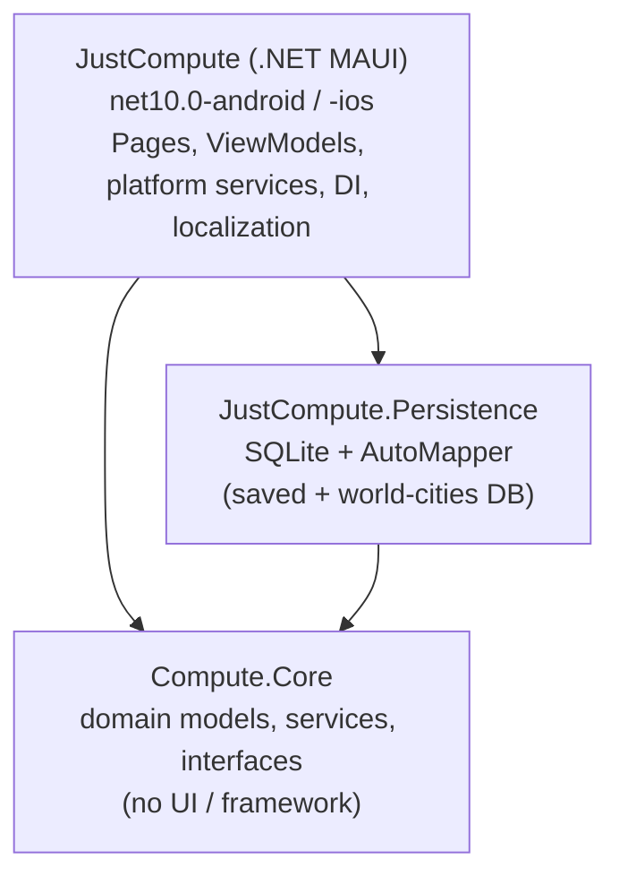

- **`Compute.Core`** — framework-agnostic domain layer: entities, the sun/moon/weather
  services, geodesy utilities, and the interfaces (navigation, dialogs, repositories, device
  services) that the app implements. Has no MAUI dependency, which keeps it unit-testable.
- **`JustCompute.Persistence`** — SQLite repositories for saved locations and the bundled
  offline world-cities database, mapped to domain models with AutoMapper.
- **`JustCompute`** — the MAUI head: pages and view models organized by **feature folder**,
  platform-specific services (Android foreground location service, iOS `CLLocationManager`),
  theming, and localization.

### Feature-modular composition

Each feature owns its registration and is composed in `MauiProgram`, so the app's surface area
is a flat, readable list rather than one giant DI block:

```csharp
builder
    .UseMauiApp<App>()
    .UseMauiCommunityToolkit()
    .ConfigureAutoMapper()
    .AddSunFeature()
    .AddMoonFeature()
    .AddSpeedAndDistanceFeature()
    // … one Add*Feature() per feature
    .ConfigureServices()
    .ConfigurePopups()
    .ConfigurePolly();
```

---

## Localization

UI strings live in `JustCompute/Resources/Strings/AppStringsRes.*.resx`, one file per locale,
surfaced in XAML through a custom `Localize` markup extension. A
[unit test](Compute.Core.Tests/Localization/AppStringsResourceConsistencyTests.cs) enforces
**key parity** across every locale and verifies that .NET format placeholders (`{0}`, `{0:N0}`,
date specifiers) are preserved in every translation, so a missing or malformed translation
fails the build rather than shipping.

A debug-only culture override (`DebugCulture`) and a deep-link screenshot harness
(`ScreenshotHarness`) make it possible to drive the app into any screen, locale and theme for
deterministic localized App Store / Play screenshots — see [`docs/store-assets-guide.md`](docs/store-assets-guide.md)
and [`scripts/`](scripts/).

---

## Building & running

### Prerequisites

- [.NET 10 SDK](https://dotnet.microsoft.com/download)
- .NET MAUI workload:
  ```bash
  dotnet workload install maui
  ```
- **Android:** Android SDK (API 36) + a JDK (installed with the MAUI workload / Android Studio)
- **iOS:** macOS with Xcode

### Run

```bash
# Android (device/emulator attached)
dotnet build -t:Run -f net10.0-android36.0 JustCompute/JustCompute.csproj

# iOS (macOS, simulator)
dotnet build -t:Run -f net10.0-ios JustCompute/JustCompute.csproj
```

The first launch copies the bundled `geo_world.db` cities database into app storage.

### Test

```bash
dotnet test Compute.Core.Tests/Compute.Core.Tests.csproj
```

---

## Project structure

```
Coordi/
├── Compute.Core/             # Domain layer: models, services, interfaces, utils (no UI)
├── Compute.Core.Tests/       # xUnit tests (domain services + localization consistency)
├── JustCompute.Persistence/  # SQLite repositories + AutoMapper profiles
├── JustCompute/              # .NET MAUI app
│   ├── Features/             # One folder per feature: Page + ViewModel + DI + converters
│   ├── Shared/               # Reusable controls, base classes, helpers, popups
│   ├── Services/             # App services (dialogs, toasts, permissions, location)
│   ├── Platforms/            # Android / iOS platform code
│   └── Resources/            # Styles, fonts, images, localized strings
├── docs/                     # Store-assets guide + screenshots
├── scripts/                  # Localized screenshot automation
└── fastlane/                 # Play Store metadata (localized listings)
```

---

## License

Licensed under the **GNU Affero General Public License v3.0** — see [LICENSE](LICENSE).
