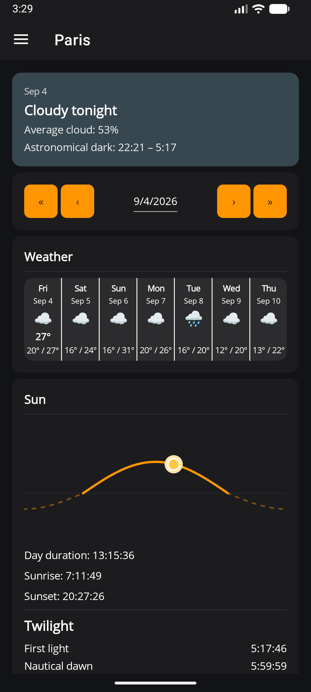
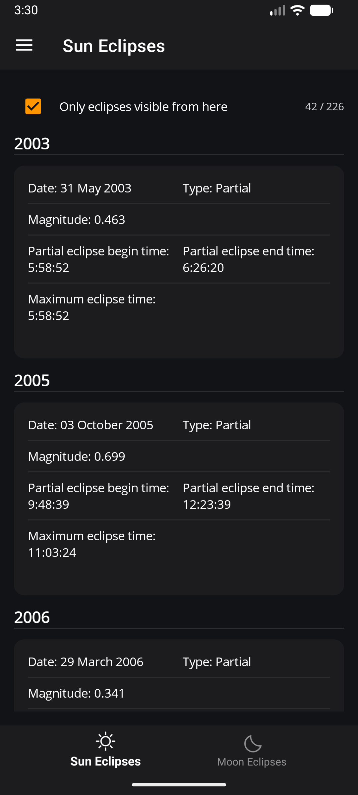
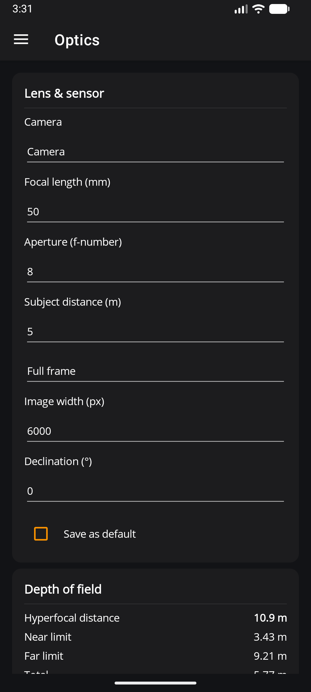
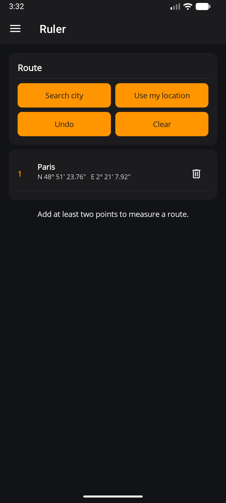
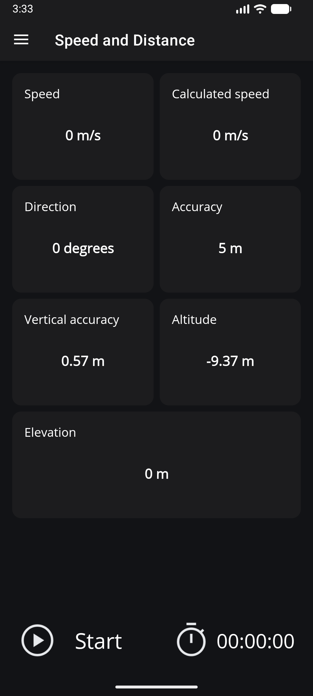
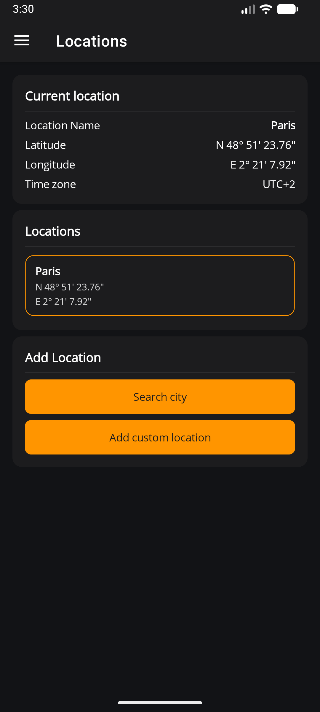
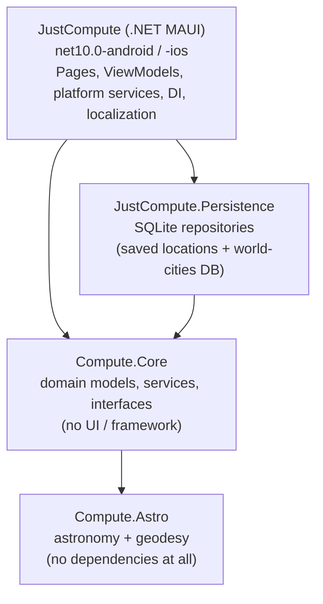

# Coordi

**Coordi** is a cross-platform mobile app for everything tied to a point on Earth: where the
Sun and Moon rise and set, when it is actually dark tonight, when the next eclipse is and
whether you will see it, the local weather and time, MGRS/UTM grid references, geodesic route
measurement, live GPS speed and distance, and an optics calculator for astrophotography — for
any city in the world or your current location.

Built with **.NET MAUI** for Android and iOS, localized into **17 UI locales** (19 Play Store
listings), with five themes.

[](https://play.google.com/store/apps/details?id=com.cutecompute.coordi)


---

## Screenshots

<p align="center">
  
  
  
</p>
<p align="center">
  
  
  
</p>

<p align="center"><sub>One .NET MAUI codebase on Android and iOS, in 17 locales and five themes.</sub></p>

---

## Features

- **🌌 Today** — one screen for a place and a date: a verdict on tonight's sky (clear, partly
  cloudy or overcast, with mean cloud cover and the hours of real astronomical darkness), an
  interactive Sun-path arc, sunrise/sunset and day length, all three twilight stages, the Moon's
  phase, illumination, rise/set and distance, both zodiac signs, MGRS and UTM grid references,
  and an optional 7-day forecast.
- **⏳ Time travel** — step to any date, a week ahead or a century back, and every reading
  recalculates.
- **🌗 Eclipses** — every solar and lunar eclipse of the century, with contact times in the
  location's own time zone, the eclipse magnitude, the type you will actually see from where
  you are (which is not always the type it is for the planet), and a filter for the ones
  visible from here.
- **📏 Ruler** — multi-stop geodesic routes: per-leg distance and initial bearing, total,
  straight-line distance, detour ratio, and a fuel calculator in L/100 km, km/L, MPG US or
  MPG imperial.
- **🛰️ Speed & distance** — GPS speedometer with a trip summary: distance travelled, direct
  distance from the start with its bearing, detour ratio, altitude and elevation change, and a
  trip timer that keeps counting past 24 hours. Records with the screen off via an Android
  foreground service.
- **📷 Optics** — depth of field (hyperfocal, near/far limits, front/behind split), field of
  view (horizontal, vertical, diagonal and real coverage), and the longest exposure before
  stars trail by both the 500 rule and the NPF rule, from your camera's own pixel pitch.
- **✨ Sky chart** — the whole sky over your location on a disc, zenith at the centre and
  east on the left the way a planisphere is read: the Yale bright stars to magnitude 4.5 tinted
  by colour index, the traditional stick figures, the IAU constellation boundaries precessed out
  of B1875, and the Sun, Moon and planets labelled. Scrubbable a day either way, and the disc
  lightens through twilight into daylight so it says whether any of it could be seen.
- **🪐 Planets** — the seven other planets from where you are: altitude and azimuth now,
  rise, highest point and set in the location's own clock, and distance from Earth. Every planet
  is listed in order out from the Sun whether or not it is up, and the outer ones that cross
  midnight carry the date so there is nothing to work out.
- **🔁 Coordinates converter** — one coordinate written five ways: decimal, DMS, DDM, UTM and
  MGRS. Reads any of the three angular forms, with a hemisphere letter or a sign, so a figure
  copied off a map or out of a message goes in as it stands, and says so plainly outside the
  UTM band rather than inventing a square.
- **🌤️ Weather** — [Open-Meteo](https://open-meteo.com/) (no key required), with retries.
- **🌐 Localized** — English, Czech, German, Spanish (ES + Latin America), French, Italian,
  Japanese, Korean, Polish, Portuguese (PT + BR), Russian, Turkish, Ukrainian and Chinese
  (Simplified + Traditional).
- **🎨 Theming** — Ocean and Blossom (light), Midnight and Ember (dark), or System.

---

## Tech stack

| Area | Technology |
| --- | --- |
| UI framework | [.NET MAUI](https://learn.microsoft.com/dotnet/maui/) 10 (Android + iOS), Shell navigation |
| Language / runtime | C# / .NET 10 |
| MVVM | [CommunityToolkit.Mvvm](https://github.com/CommunityToolkit/dotnet) (source-generated observables & commands) |
| UI toolkit | [CommunityToolkit.Maui](https://github.com/CommunityToolkit/Maui) |
| Astronomy / geodesy | **`Compute.Astro`** — in-house, dependency-free (see below) |
| Time zones | [GeoTimeZone](https://github.com/mattjohnsonpint/GeoTimeZone) + [NodaTime](https://nodatime.org/) |
| Weather | [Open-Meteo](https://open-meteo.com/) REST API |
| Resilience | [Polly](https://github.com/App-vNext/Polly) (exponential-backoff retries) |
| Persistence | [sqlite-net](https://github.com/praeclarum/sqlite-net), hand-written mappers |
| Localization | `Microsoft.Extensions.Localization` + `.resx` resources |
| Testing | xUnit — 378 tests |

### Compute.Astro

The astronomy and geodesy are not a dependency — they are a library in this repo, published
separately as [`CuteCompute.Astro`](https://www.nuget.org/packages/CuteCompute.Astro) under
**AGPL-3.0**, the same licence as everything else here.

It is a clean-room implementation written from published algorithms (Meeus, *Astronomical
Algorithms* 2nd ed.; Vincenty 1975; Snyder/USGS PP 1395) with no third-party runtime
dependencies, replacing the AGPL-licensed CoordinateSharp the app originally used. It covers
sun and moon positions, rise/set and twilight, phases and illumination, solar and lunar
eclipses including local circumstances, planets, constellations, bright stars, the tropical
zodiac, Vincenty geodesics, UTM/MGRS, and coordinate formatting.

Correctness is held to external references rather than to itself: positions are checked against
JPL Horizons, geodesics against GeographicLib (worst error 0.218 m across 636 cases, including
the near-antipodal ones Vincenty's inverse cannot solve), and twilight against astral.

---

## Architecture

Six projects, with a deliberate dependency direction — presentation depends on the domain,
never the reverse, and the astronomy layer depends on nothing at all:


```mermaid
flowchart TD
    MAUI["JustCompute (.NET MAUI)<br/>net10.0-android / -ios<br/>Pages, ViewModels, platform services, DI, localization"]
    PERS["JustCompute.Persistence<br/>SQLite repositories<br/>(saved locations + world-cities DB)"]
    CORE["Compute.Core<br/>domain models, services, interfaces<br/>(no UI / framework)"]
    ASTRO["Compute.Astro<br/>astronomy + geodesy<br/>(no dependencies at all)"]
    MAUI --> PERS
    MAUI --> CORE
    PERS --> CORE
    CORE --> ASTRO
```

- **`Compute.Astro`** — dependency-free astronomy and geodesy. Targets `netstandard2.0` and
  `net8.0` so it is usable outside this app.
- **`Compute.Core`** — framework-agnostic domain layer: entities, sun/moon/weather services,
  route and fuel planning, optics, and the interfaces the app implements. No MAUI dependency,
  which keeps it unit-testable.
- **`JustCompute.Persistence`** — SQLite repositories for saved locations and the bundled
  offline world-cities database (42,905 cities).
- **`JustCompute`** — the MAUI head: pages and view models organized by **feature folder**,
  platform services (Android foreground location service, iOS `CLLocationManager`), theming
  and localization.

### Feature-modular composition

Each feature owns its registration and is composed in `MauiProgram`, so the app's surface area
is a flat, readable list rather than one giant DI block:

```csharp
builder
    .UseMauiApp<App>()
    .UseMauiCommunityToolkit()
    .AddTodayFeature()
    .AddSunEclipsesFeature()
    .AddMoonEclipsesFeature()
    .AddOpticsFeature()
    .AddDistanceFeature()
    .AddSpeedAndDistanceFeature()
    // … one Add*Feature() per feature
    .ConfigureServices();
```

### Design system

Spacing, typography and card styling are tokens in `Resources/Styles/Styles.xaml`, on the
Material 3 / Apple HIG values for a compact window: a 16 screen margin, 16 inside a card, 8
between cards, a 12 corner, and a 48 minimum touch target — all on the 4 grid both systems use.
Insets are padding only; cards carry no margin, so a gap is one number rather than a sum.

---

## Localization

UI strings live in `JustCompute/Resources/Strings/AppStringsRes.*.resx`, one file per locale,
surfaced in XAML through a custom `Localize` markup extension. A
[unit test](Compute.Core.Tests/Localization/AppStringsResourceConsistencyTests.cs) enforces
**key parity** across every locale and verifies that .NET format placeholders (`{0}`, `{0:N0}`,
date specifiers) survive translation, so a missing or malformed string fails the build rather
than shipping. A second
[test](Compute.Core.Tests/Localization/StoreLocaleCoverageTests.cs) checks the other direction:
every locale with a Play Store listing must resolve, through the culture fallback chain, to a
resx the app actually ships — so a translated listing never leads to an English app.

A debug-only culture override (`DebugCulture`) and a deep-link screenshot harness
(`ScreenshotHarness`) drive the app into any screen, locale and theme for deterministic
localized store screenshots — see [`docs/store-assets-guide.md`](docs/store-assets-guide.md)
and [`scripts/`](scripts/).

---

## Building & running

### Prerequisites

- [.NET 10 SDK](https://dotnet.microsoft.com/download)
- .NET MAUI workload:
  ```bash
  dotnet workload install maui
  ```
- **Android:** Android SDK (API 36) + a JDK (installed with the MAUI workload / Android Studio)
- **iOS:** macOS with Xcode

### Run

```bash
# Android (device/emulator attached)
dotnet build -t:Run -f net10.0-android36.0 JustCompute/JustCompute.csproj

# iOS (macOS, simulator)
dotnet build -t:Run -f net10.0-ios JustCompute/JustCompute.csproj
```

The first launch copies the bundled `geo_world.db` cities database into app storage.

### Test

```bash
dotnet test JustCompute.sln
```

---

## Project structure

```
Coordi/
├── Compute.Astro/            # Astronomy + geodesy, no dependencies (NuGet: CuteCompute.Astro)
├── Compute.Astro.Tests/      # Validation against JPL Horizons, GeographicLib, astral
├── Compute.Core/             # Domain layer: models, services, interfaces, utils (no UI)
├── Compute.Core.Tests/       # xUnit tests (domain services + localization consistency)
├── JustCompute.Persistence/  # SQLite repositories + mappers
├── JustCompute/              # .NET MAUI app
│   ├── Features/             # One folder per feature: Page + ViewModel + DI + converters
│   ├── Shared/               # Reusable controls, base classes, helpers, popups
│   ├── Services/             # App services (dialogs, toasts, permissions, location)
│   ├── Platforms/            # Android / iOS platform code
│   └── Resources/            # Styles, fonts, images, localized strings
├── docs/                     # Store-assets guide, design masters, screenshots
├── scripts/                  # Localized screenshot automation
└── fastlane/                 # Play Store metadata (19 localized listings)
```

---

## License

The whole repository is licensed under the **GNU Affero General Public License v3.0** — see
[LICENSE](LICENSE). That includes `Compute.Astro/`, which carries the same text so the NuGet
package is self-contained, and is published as `CuteCompute.Astro` under it.

`Compute.Astro` was Apache-2.0 until September 2026. Versions published before then keep that
licence — a granted permission cannot be withdrawn — so use the licence stated on the package
version you actually take.
